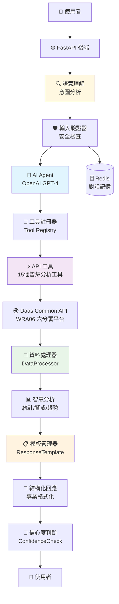
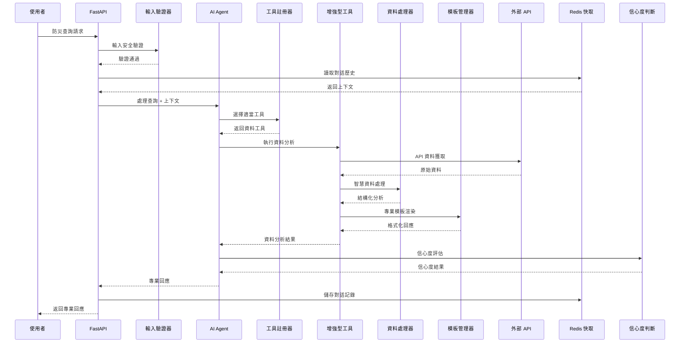

# 第六河川分署智慧防災問答小幫手 AI Agent

[](LICENSE)
[](https://python.org)
[](https://fastapi.tiangolo.com)
[](https://docker.com)

> 基於 OpenAI GPT-4 的智慧防災問答系統，整合第六河川分署防災資料平台，提供專業的防災資訊查詢與分析服務。

## 🎯 專案特色

- 🤖 **智慧問答**: 基於 OpenAI GPT-4 的自然語言理解
- 🔧 **增強型工具**: 15個專業防災工具，支援智慧分析和結構化回應  
- 💬 **多輪對話**: Redis 支援的持續對話記憶功能
- 🛡️ **安全機制**: 多層輸入驗證和安全防護
- 🐋 **容器化部署**: 完整的 Docker 開發和生產環境
- 📊 **專業分析**: 縣市統計、警戒分析、趨勢預測

## 🏗️ 系統架構



## 🔄 資料流程



## 🚀 快速開始

### 環境需求
- Python 3.9+
- Docker & Docker Compose
- OpenAI API Key

### 一鍵部署 (推薦)

```bash
# 1. 複製專案
git clone <repository-url>
cd wra06-ai-agent-2

# 2. 設置環境變數
cp env.example .env
# 編輯 .env 檔案，設置 OPENAI_API_KEY

# 3. 啟動服務 (包含 Redis 和完整功能)
# Windows PowerShell
.\docker-helper.ps1 dev-up

# Linux/macOS
make dev-up

# 4. 驗證服務
curl http://localhost:8000/health
```

### 本地開發環境

<details>
<summary>點擊展開本地安裝說明</summary>

```bash
# 建立虛擬環境
python -m venv venv
source venv/bin/activate  # Windows: venv\Scripts\activate

# 安裝依賴
pip install -r requirements.txt

# 設置環境變數
cp env.example .env
# 編輯 .env 填入必要配置

# 啟動 Redis (必需，用於對話功能)
docker run -d -p 6379:6379 redis:latest

# 啟動應用
uvicorn app.main:app --reload
```

</details>

## 📋 支援的防災查詢

| 類型 | 功能 | 工具數量 | 增強分析 |
|------|------|----------|----------|
| 🌧️ **雨量資訊** | 即時/歷史雨量查詢 | 2個 | ✅ 智慧分析 |
| 🌊 **河川水位** | 即時/歷史水位監測 | 2個 | 📋 計劃中 |
| 🌪️ **淹水感測** | 淹水深度警戒監測 | 1個 | 📋 計劃中 |
| 🚰 **移動泵浦** | 台南/高雄/六分署泵浦 | 3個 | 📋 計劃中 |
| 🏭 **抽水站** | 運作狀況與水位監測 | 1個 | 📋 計劃中 |
| 🚪 **水門設施** | 開啟狀態與觀測資料 | 1個 | 📋 計劃中 |
| 🏞️ **滯洪池** | 蓄水狀況與容量監測 | 2個 | 📋 計劃中 |
| 🕳️ **下水道** | 水位監測與警戒狀況 | 3個 | 📋 計劃中 |

## 💬 使用範例

### 基本查詢
```bash
curl -X POST "http://localhost:8000/chat" \
  -H "Content-Type: application/json" \
  -d '{"query": "台南市目前的雨量狀況如何？"}'
```

### 多輪對話
```bash
# 第一輪
curl -X POST "http://localhost:8000/chat" \
  -H "Content-Type: application/json" \
  -d '{
    "query": "台南市目前的雨量狀況如何？",
    "conversation_id": "session_123"
  }'

# 第二輪追問
curl -X POST "http://localhost:8000/chat" \
  -H "Content-Type: application/json" \
  -d '{
    "query": "那高雄市呢？",
    "conversation_id": "session_123"
  }'
```

### 增強分析回應範例

<details>
<summary>點擊查看專業回應格式</summary>

```
📊 臺南市即時雨量觀測分析報告

🔍 **觀測摘要**
- 觀測時間: 2024-01-15 14:30:00
- 測站總數: 25 個
- 資料來源: 即時雨量觀測資料

⚠️ **警戒狀況** 
目前有 3 個測站達到警戒標準：
- 大雨警戒: 2 個測站
- 豪雨警戒: 1 個測站

🗺️ **縣市概覽**
| 縣市   | 測站數 | 平均雨量 | 最大雨量 | 警戒測站 |
|--------|--------|----------|----------|----------|
| 臺南市 | 25     | 8.5mm    | 45.2mm   | 3        |

🏆 **24小時累積雨量排行榜**
1. 玉井測站: 45.2mm ⚠️ 豪雨
2. 楠西測站: 38.7mm ⚠️ 大雨  
3. 南化測站: 35.1mm ⚠️ 大雨

📡 **測站狀態**
- 正常運作: 23 個 (92%)
- 維護中: 2 個 (8%)
```

</details>

## 🛠️ Docker 管理工具

### Windows PowerShell
```powershell
.\docker-helper.ps1 help         # 查看所有指令
.\docker-helper.ps1 build        # 建構映像
.\docker-helper.ps1 dev-up       # 啟動開發環境
.\docker-helper.ps1 up           # 啟動生產環境
.\docker-helper.ps1 health       # 健康檢查
.\docker-helper.ps1 redis-test   # Redis 連線測試
.\docker-helper.ps1 conv-status  # 對話功能狀態
```

### Linux/macOS Makefile
```bash
make help                        # 查看所有指令
make build                       # 建構映像
make dev-up                      # 啟動開發環境
make up                          # 啟動生產環境
make health                      # 健康檢查
```

## 📊 API 端點

| 端點 | 方法 | 功能 | 說明 |
|------|------|------|------|
| `/` | GET | 基本資訊 | 服務狀態和版本資訊 |
| `/health` | GET | 健康檢查 | 服務運行狀態 |
| `/chat` | POST | 智慧問答 | 核心對話功能 |
| `/tools` | GET | 工具列表 | 所有可用工具資訊 |
| `/examples` | GET | 查詢範例 | 防災查詢範例 |
| `/redis-test` | GET | Redis 測試 | 連線狀態檢查 |
| `/conversation-status` | GET | 對話狀態 | 多輪對話功能狀態 |

**API 文件**: [Swagger UI](http://localhost:8000/docs) | [ReDoc](http://localhost:8000/redoc)

## 📁 專案結構

```
wra06-ai-agent-2/
├── app/                         # 主要應用程式
│   ├── agents/                  # AI Agent 核心
│   ├── models/                  # 資料模型和 Schema
│   ├── routes/                  # FastAPI 路由
│   ├── tools/                   # 工具系統
│   │   ├── base.py             # 工具基類
│   │   ├── enhanced_tools.py   # 增強型工具框架
│   │   ├── data_processor.py   # 智慧資料處理器
│   │   ├── response_template.py # 回應模板管理器
│   │   └── water_tools.py      # 防災工具實作
│   ├── utils/                  # 工具程式
│   └── validators/             # 安全驗證器
├── docs/                       # 📚 完整技術文件
│   ├── technical_architecture_deep_dive.md # 🧠 技術架構深度解析
│   ├── technical_guide.md      # 🔧 技術架構指南
│   ├── enhanced_tools_architecture.md # ⚡ 增強型工具系統
│   ├── conversation_feature_guide.md  # 💬 多輪對話功能
│   ├── security_features.md    # 🛡️ 安全機制文件
│   └── development_plan.md     # 📋 開發計畫
├── tests/                      # 測試套件
├── docker-helper.ps1           # Windows Docker 管理腳本
├── Makefile                    # Linux/macOS 管理工具
└── requirements.txt            # Python 依賴
```

## 📚 完整技術文件

- **[🧠 技術架構深度解析](docs/technical_architecture_deep_dive.md)** - 語意理解、Redis、信心度計算完整技術流程
- **[🔧 技術架構指南](docs/technical_guide.md)** - 系統架構、JWT認證、工具系統詳解
- **[⚡ 增強型工具系統](docs/enhanced_tools_architecture.md)** - 智慧分析工具架構和開發指南  
- **[💬 多輪對話功能](docs/conversation_feature_guide.md)** - Redis 對話記憶和使用指南
- **[🛡️ 安全機制文件](docs/security_features.md)** - 輸入驗證和安全防護機制
- **[📋 開發計畫](docs/development_plan.md)** - 專案開發規劃和里程碑

## 🔧 開發指南

### 新增增強型工具
1. 建立資料處理器 (`DataProcessor`)
2. 設計回應模板 (`ResponseTemplate`)  
3. 實作增強工具類 (`EnhancedTool`)
4. 建立相容包裝器 (OpenAI Function Calling)
5. 註冊到工具系統

詳細說明請參考 **[增強型工具系統文件](docs/enhanced_tools_architecture.md)**

### 開發環境設置
```bash
# 啟動開發環境 (包含熱重載、Redis、完整日誌)
.\docker-helper.ps1 dev-up

# 進入容器除錯
.\docker-helper.ps1 dev-shell

# 查看即時日誌
.\docker-helper.ps1 dev-logs
```

## 🧪 測試驗證

```bash
# 執行完整測試套件
pytest tests/ -v

# 測試特定功能
pytest tests/test_conversation.py -v  # 對話功能
pytest tests/test_agent.py -v         # AI Agent
pytest tests/test_input_validation.py -v # 安全驗證

# 手動功能測試
curl http://localhost:8000/health      # 基本健康檢查
curl http://localhost:8000/redis-test  # Redis 連線測試
curl http://localhost:8000/jwt-test    # JWT Token 測試
```

## 🚀 部署指南

### 生產環境部署
```bash
# 生產環境啟動 (最佳化配置)
.\docker-helper.ps1 up

# 檢查服務狀態
.\docker-helper.ps1 status

# 查看生產日誌
.\docker-helper.ps1 logs
```

### 環境變數配置
```env
# 必要配置
OPENAI_API_KEY=your_openai_api_key_here

# Redis 配置 (Docker 環境)
REDIS_URL=redis://redis:6379
ENABLE_CONVERSATION_MEMORY=true

# JWT 配置 (自動獲取)
JWT_LOGIN_URL=https://wdgi.wra.gov.tw/wra6_api/lineapp_login
```

## 📊 系統監控

- **應用日誌**: `logs/app.log`
- **健康檢查**: `GET /health` 
- **Redis 狀態**: `GET /redis-test`
- **對話功能**: `GET /conversation-status`
- **工具狀態**: `GET /tools`
